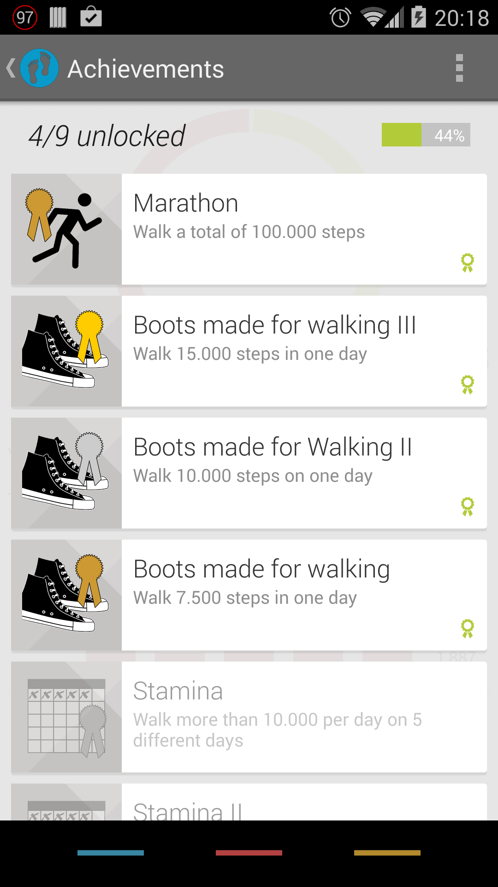

Pedometer
=========

Lightweight pedometer app inspiered by j4velin: https://github.com/j4velin/Pedometer

Pedometer uses the [EazeGraphLibrary](https://github.com/blackfizz/EazeGraph "EazeGraphLibrary") by Paul Cech and [a fork](https://github.com/j4velin/colorpicker) of [ColorPickerPreference](https://github.com/attenzione/android-ColorPickerPreference "android-ColorPickerPreference: Android color picking library") by Sergey Margaritov.

<table sytle="border: 0px;">
<tr>
<td></td>
<td></td>
</tr>
</table>
